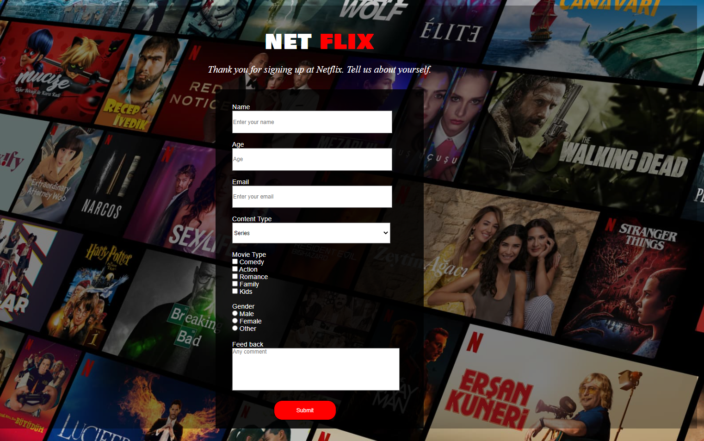
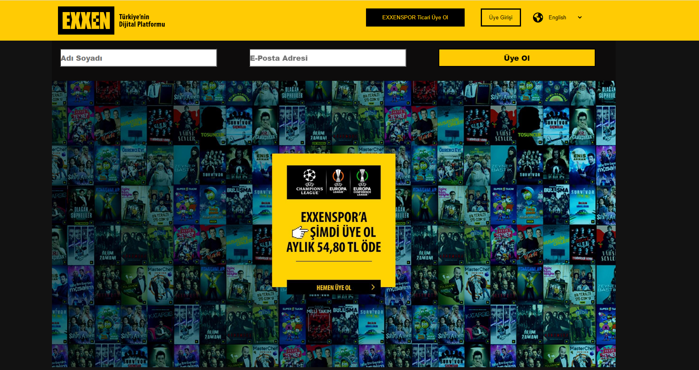
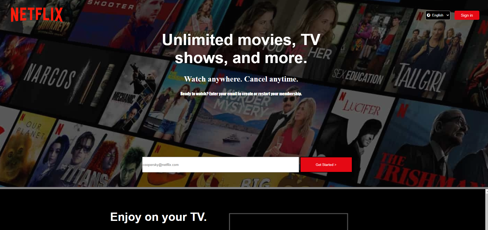
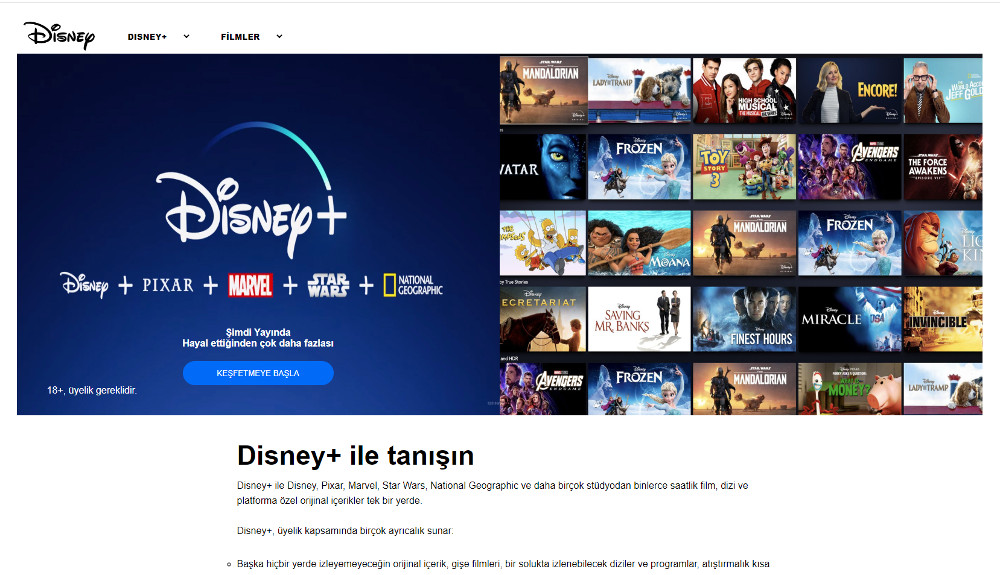
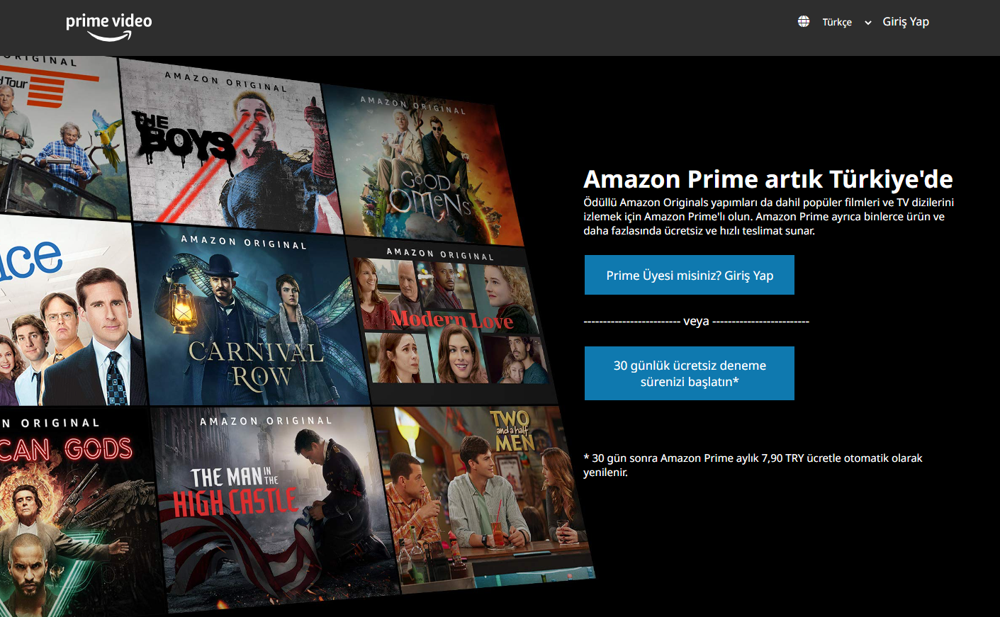

# Project : Online Video Platforms-Clone

## Check The Live Website ➡️ [Live Website](https://skycooper.github.io/OnlineVideoPlatforms-Clone/)

## Animation of the Website

## Visualization of the Website

## Description

## Learning Outcomes

At the end of the this project, you will be able to;
- analyze a problem,
- demonstrate your knowledge of algorithmic design principles,

## Project Skeleton 

|----Online Video Platforms-Clone

        |----Netflix Submit Form 
        |----Netflix Main Page
        |----Exxen
        |----Disney Plus
        |----Amazon Prime
        |----images
        |----index.html
        |----style.css
        |----readme.md 

### Overview
I mastered HTML and CSS features in this project. You can see the visual representation of the website above.
